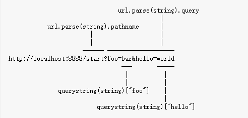

## 进行请求的路由
### ur

通过url对象接受到请求的路径
```javascript
var http = require("http");
var url = require("url");

function start() {
  function onRequest(request, response) {
    var pathname = url.parse(request.url).pathname;
    console.log("Request for " + pathname + " received.");
    response.writeHead(200, {"Content-Type": "text/plain"});
    response.write("Hello World");
    response.end();
  }

  http.createServer(onRequest).listen(8888);
  console.log("Server has started.");
}

exports.start = start;
```

